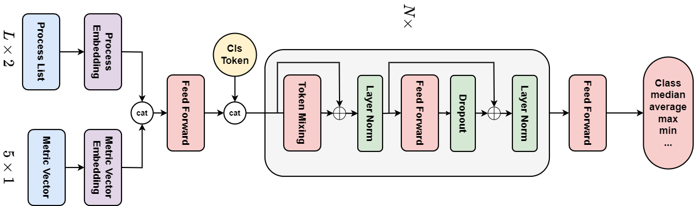

# Adaptive RoundRobin
by Dang Vu Tuan Kiet, Truong Binh Minh, Nguyen Do Trung Kien, Tran Nguyen Bao.

This repository contain code for honor assignment of Operating System Course.

## Abstract

The traditional Round Robin scheduling is fair but can be slow due to frequent context switching with short time slices. It can also neglect short processes if the time slices are long. This research introduces a new Adaptive Round Robin algorithm that uses a deep learning technique called self-attention to automatically adjust the time slice based on what the user wants to prioritize and the current mix of processes. Early results show it can achieve 88.8% accuracy while still being fast with 3,000 FPS.

## Architecture

## Getting the code

You can download a copy of all the files in this repository by cloning the git repository:

    git clone https://github.com/Kiet0712/AdaptiveRoundRobin
    cd AdaptiveRoundRobin/

## Dependencies

You'll need a working Python environment to run the code.
Run pip to install dependencies.

    pip install -r requirements.txt

## Reproducing the results

Run the main.py file with python.

    python main.py

## License

All source code is made available under a BSD 3-clause license. You can freely use and modify the code, without warranty, so long as you provide attribution to the authors. See `LICENSE.md` for the full license text.
